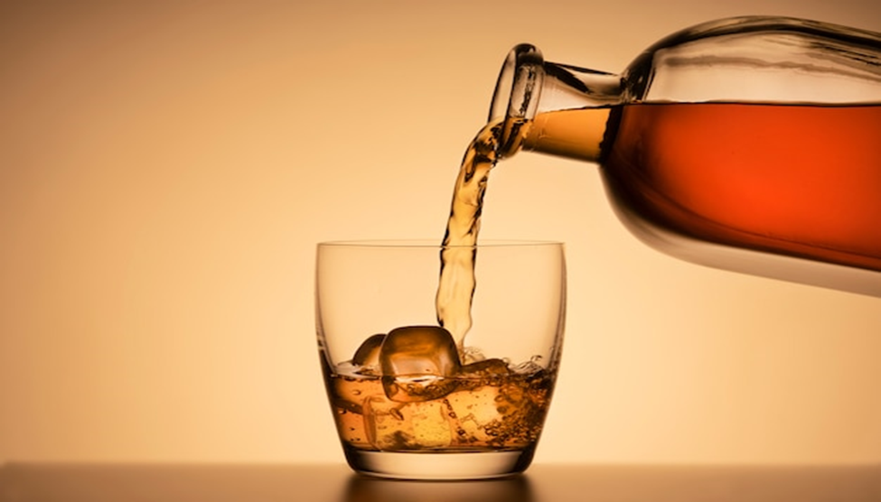

 \

# Can I pour you a drink?

## Overview and Origin

In recent years, the American whiskey scene has experienced a 9.4% increase in sales from 2020 to 2022. The global whiskey market is projected to reach \$85 billion by 2028, with recorded world whiskey sales of \$66.5 billion in 2022. As production and sales continue to grow, competition among distilleries intensifies, with new distilleries entering the market. From 2000 to 2022, the U.S. added 1,015 new whiskey distilleries, and as of 2022, 95.1% of all whiskey distilleries were less than 22 years old.

Artificial intelligence (AI) has made its way into the whiskey industry, with several applications in marketing, sustainability, and understanding flavor profiles. At Distiller.com, every article concludes with:

With Distiller, you’ll always know what’s in the bottle before you spend a cent. Rate, Review, and Discover spirits. Head on over to [Distiller](https://distiller.com/), or download the app for iOS and Android today! (Mossberg, Mikal, June 2024)

The company’s mission is to provide you with the intelligence to determine if what’s inside the bottle is something you will enjoy.

\* Name of Company

[Distiller](https://distiller.com/) currently offers three apps utilizing AI: Distiller, Flasky, and GlassEye. The [Distiller app](https://distiller.com/articles/using-flavor-search) boasts a database of over 50,000 bottles of distilled spirits, each with a review, rank, and flavor profile. You can use the free app to search for various bottles in their database. The Pro version allows you to select your personal flavor profiles from a list of over 80, and the app will recommend specific bottles that align with your preferences.

The [Flasky app](https://distiller.com/articles/meet-flasky) is a chatbot similar to ChatGPT. You can ask questions regarding which bottles to buy for occasions like a boss's birthday or a housewarming party. Flasky can also ask you questions about various flavor profiles it generates. Based on your responses, Flasky suggests a bottle and looks up the nearest liquor store where you can purchase it or a local bar that serves it.

Distiller’s most recent app, [GlassEye – Cocktail Creator](https://distiller.com/articles/introducing-glasseye-cocktail-creator), allows you to group your ingredients, mixers, and spirits into a photo. It then creates a cocktail and provides a recipe for your drink. This is a unique app that I personally tried twice, using varying ingredients and mixers against a backdrop of whiskey bottles on a shelf. By removing various items, new recipes were created.

All three Distiller apps are either subscription-based or available for a one-time purchase. They also offer a bundle for Flasky and GlassEye with a \$1 discount.

\* When was the company incorporated?

Distiller was incorporated in the fall of 2013.

\* Who are the founders of the company?

Brent Stiefel and Mikael Mossberg

\* How did the idea for the company or projects come about?

[Distiller.com](https://distiller.com) was founded by like-minded individuals who shared an appreciation for whiskey. Whiskey is an alcoholic beverage made from various grains, water, yeast, and aged in charred oak barrels. The variants of grains, the percentage of the mash bill, the quality of water, and even the oak tree's growing conditions all come together to produce a unique flavor profile. Many distilleries blend hundreds of barrels to create a standard flavor profile year after year. Recently, more individuals and whiskey clubs are seeking out the “honey barrel” to bottle as a single-barrel product.

Distiller.com was created to bridge the gap in understanding these unique and different flavor profiles among distilleries, helping consumers purchase bottles they are likely to enjoy based on reviews, ratings, and flavor characteristics.

\* How is the company funded? How much funding have they received?

The company is funded through private equity. [Votiv Capital](https://pitchbook.com/profiles/investor/384721-93) recently invested \$100,000 into Distiller. Historically, Votiv Capital has invested in the media sector. Distiller is their second investment in Information Services, the other being Baseball Prospectus, which focuses on the sabermetric analysis of baseball.

\#\# Business Activities

\* What specific problem is the company or project trying to solve?

Distiller.com aims to provide consumers with as much information as possible before making any spirit purchase. They want you to know what’s in the bottle based on ratings, reviews, and your flavor preferences before you spend a cent.

\* Who is the company’s intended customer? Is there any information about the market size for this set of customers?

Distiller.com’s products are intended for legal-age drinking customers. In the U.S., the legal drinking age is 21 years old. Currently, 77.9% of the U.S. population is 21 and older.

\* What solution does this company offer that their competitors do not or cannot offer? (What is the unfair advantage they utilize?)

Distiller.com has categorized over 50,000 different spirits in their database, giving them an edge over Diageo’s “What’s Your Whiskey?” app, which only profiles their products and reduces flavor profiles to 11 tastes. Distiller.com offers over 80 flavor profiles to choose from and is not aligned with any specific distillery, providing a service that collects ratings and reviews on all distilled spirits.

\#\# Landscape

\* What field is the company in?

Distiller.com operates in the service industry, providing products to enhance the experience of buying a product that consumers will enjoy before tasting it.

\* What have been the major trends and innovations of this field over the last 5 years, 10 years?

Before AI, the distilled spirits industry relied on in-house descriptions of flavor profiles, customer reviews, and international award events. Distiller.com has released three AI-driven apps: Distiller App (9/2021), Flasky App (4/2024), and GlassEye – Cocktail Creator (6/2024). With the growing presence of AI in marketing, Distiller.com has established its products as industry leaders.

\* What are the other major companies in this field?

[Diageo](https://www.diageo.com/en) is the global leader in Total Beverage Alcohol, owning over 200 brands with products available in 180 countries. In 2022, Diageo purchased [Vivanda](https://vivanda.flavorprintlab.com/), which developed their [FlavorPrint](https://vivanda.flavorprintlab.com/about-us.html) AI, originally a spin-off from a team at McCormick spices. With Vivanda, Diageo created a website interface that asks consumers how they "feel" about 11 different flavors using a creative 5-point scale. Based on the results, Diageo suggests products that match the consumer’s flavor profile.

[Drinks](https://drinks.com/), a competitor in the alcohol world of wine, offers a comprehensive service for marketing labels, bottles, and e-commerce websites. Their AI works with wine-related flavor profiles, design, and color emotions to influence market share. Their theory is based on the human connection to emotions while standing at the shelf in a liquor store. Drinks has proprietary [Label AI and Perception AI](https://drinks.com/pair#oembed_container-widget_1694021407037) and recently released a [tax and compliance AI app](https://drinks.com/shopify-app) to help launch online wine e-commerce businesses. You don’t even have to grow your own grapes!

\#\# Results

\* What has been the business impact of this company so far?

Distiller.com is developing apps to assist and educate consumers on all aspects of distilled spirits. Currently, their Distiller app averages over 2,100 purchases per month, offering both monthly and yearly subscriptions. Their latest apps, Flasky and GlassEye – Cocktail Creator, are too new on the market to gauge direct business impact. Their design focuses on educating consumers about all distilled spirits rather than marketing specific brands. The Distiller app even allows users to submit reviews of bottles, which are then added to the database to further assist consumers.

\* What are some of the core metrics that companies in this field use to measure success? How is your company performing based on these metrics?

Core metrics in the Total Alcohol Beverage market include sales and market share. Distiller.com is still in the early stages of developing a comprehensive impact, especially compared to established players like Diageo.

\* How is your company performing relative to competitors in the same field?

Drinks.com offers case studies demonstrating the success of their products in the wine market. For example, [Ritual Zero Proof](https://drinks.com/hubfs/Ritual%20Case%20Study%20Deck.pdf) America’s first non-alcoholic spirit brand, experienced significant growth after partnering with Electriq, a Drinks.com app. Click-through rates increased by 267%, auto-order placements jumped 56%, and SMS share of Shopify revenue surged 220%.

[Diageo's "What’s Your Whiskey"](https://www.whatsyourwhisky.com/en-us/intro) app has contributed to a 4.4% increase in market share over the past 10 years, while the overall alcoholic beverage market saw a 5.1% increase in sales during the same period.

\#\# Recommendations

\* If you were to advise the company, what products or services would you suggest they offer? (This could be something that a competitor offers or use your imagination!)

I would advise Distiller.com to continue refining their three apps and develop a marketing strategy to bring their data to individual distilleries or branding groups. With Diageo holding 4.7% of the market share, Distiller.com could position itself to help others gain more market share. Currently, Diageo ranks at the top in the Total Alcohol Beverage market.

\* Why do you think that offering this product or service would benefit the company?

Partnering with distilleries and applying their extensive database for marketing purposes could create significant growth opportunities for Distiller.com. The company was founded to gather information in one place, and with over 50,000 products reviewed, they are well-positioned to help distilleries market their products more effectively. The Distiller app’s ability to match consumers with products based on 80 flavor profiles is a unique advantage that could significantly benefit distilleries.

\* What technologies would this additional product or service utilize?

Distiller.com would need to invest in label generation technology and develop an emotion tracker to enhance product marketing and streamline production. AI could assist in developing products that consumers would flock to, reducing the gamble distilleries currently take on flavor profiles. For example, [Mackmyra Whiskey](https://www.forbes.com/sites/neilsahota/2024/03/27/the-digital-distiller-ai-transforms-the-time-honored-art-of-whiskey-making/) in Sweden partnered with Microsoft and Fourkind to let AI analyze historical recipes, sales data, and customer preferences to create a popular and innovative whiskey.

\* Why are these technologies appropriate for your solution?

AI-driven marketing applications have proven successful in the wine industry, and Distiller.com could leverage similar techniques to stay ahead in the distilled spirits market. If Distiller.com does not develop and apply similar technologies, competitors will. While enjoyment of a good drink is important, the Total Alcohol Beverage industry ultimately seeks to generate revenue.

\#\# Works Cited

**Apple App Store**. *Distiller - Liquor Reviews*. Apple, <https://apps.apple.com/us/app/distiller-liquor-reviews/id784925833>. Accessed 9 Aug. 2024.

**Apple App Store**. *Flasky - Liquor Recommendations*. Apple, <https://apps.apple.com/us/app/flasky-liquor-recommendations/id6478173941>. Accessed 9 Aug. 2024.

**Apple App Store**. *GlassEye - Cocktail Creator*. Apple, <https://apps.apple.com/us/app/glasseye-cocktail-creator/id6472605427>. Accessed 9 Aug. 2024.

*ChatGPT Conversation*. OpenAI, <https://chatgpt.com/c/aaf62eec-0c0c-478e-9d40-989ba9624b15>. Accessed 10 Aug. 2024.

O'Shea, Claire. "The State of the Whiskey Market." *Daily SevenFifty*, 21 June 2023, <https://daily.sevenfifty.com/the-state-of-the-whiskey-market/>. Accessed 9 Aug. 2024.

*Distiller*. "Coming Soon: The New Distiller App." *Distiller*, <https://distiller.com/articles/coming-soon-the-new-distiller-app>. Accessed 9 Aug. 2024.

*Distiller*. "Introducing GlassEye - Cocktail Creator." *Distiller*, <https://distiller.com/articles/introducing-glasseye-cocktail-creator>. Accessed 9 Aug. 2024.

*Distiller*. "Meet Flasky." *Distiller*, <https://distiller.com/articles/meet-flasky>. Accessed 9 Aug. 2024.

*Distiller*. "Using Flavor Search." *Distiller*, <https://distiller.com/articles/using-flavor-search>. Accessed 9 Aug. 2024.

*Distiller*. "Values." *Distiller*, <https://distiller.com/pages/values>. Accessed 9 Aug. 2024.

*American Distilling Institute*. "Distilling Resources." *Distilling.com*, <https://distilling.com/resources/data/>. Accessed 9 Aug. 2024.

*American Distilling Institute*. "Distilling Resources." *Distilling.com*, <https://distilling.com/resources/data/>. Accessed 9 Aug. 2024.

*Drinks.com*. "Case Studies." *Drinks*, <https://drinks.com/case-studies>. Accessed 9 Aug. 2024.

Maseko, Tumi. "AI Is Mixing Liquor Brands to Sell." *Yahoo Finance*, 23 April 2024, <https://finance.yahoo.com/news/ai-mixing-liquor-brands-sell-150000565.html>. Accessed 10 Aug. 2024.

Maseko, Tumi. "AI Is Mixing Liquor Brands to Sell." *Yahoo Finance*, 23 April 2024, <https://finance.yahoo.com/news/ai-mixing-liquor-brands-sell-150000565.html>. Accessed 10 Aug. 2024.

*PitchBook*. "Distiller Company Profile." *PitchBook*, <https://pitchbook.com/profiles/company/113877-46>. Accessed 10 Aug. 2024.

*PitchBook*. "Votiv Capital Investor Profile." *PitchBook*, [https://pitchbook.com/profiles/investor/384721-93\#investments](https://pitchbook.com/profiles/investor/384721-93#investments). Accessed 10 Aug. 2024.

*Sovos Blog*. "Is Artificial Intelligence the Right Mixer for Beverage Alcohol?" *Sovos*, 14 May 2023, <https://sovos.com/blog/ship/is-artificial-intelligence-the-right-mixer-for-beverage-alcohol/>. Accessed 10 Aug. 2024.

*Vivanda FlavorPrint Lab*. "Home." *Vivanda*, <https://vivanda.flavorprintlab.com/>. Accessed 10 Aug. 2024.

*Vivanda FlavorPrint Lab*. "About Us." *Vivanda*, <https://vivanda.flavorprintlab.com/about-us.html>. Accessed 10 Aug. 2024.

*Vivanda FlavorPrint Lab*. "Digitizing Food." *Vivanda*, <https://vivanda.flavorprintlab.com/digitizing-food.html>. Accessed 10 Aug. 2024.

Husain, Imran. "Diageo Turns to AI to Help People Discover Whisky." *Beverage Daily*, 28 Nov. 2019, <https://www.beveragedaily.com/Article/2019/11/28/Diageo-turns-to-AI-to-help-people-discover-whisky>. Accessed 10 Aug. 2024.

*U.S. Census Bureau*. "The United States Adult Population Grew Faster Than the Nation’s Total Population from 2010 to 2020." *United States Census Bureau*, 12 Aug. 2021, <https://www.census.gov/library/stories/2021/08/united-states-adult-population-grew-faster-than-nations-total-population-from-2010-to-2020.html>. Accessed 11 Aug. 2024.

*Crunchbase*. "Distiller Profile." *Crunchbase*, <https://www.crunchbase.com/organization/distiller-2>. Accessed 11 Aug. 2024.

*Diageo*. "Diageo Annual Report 2024." *Diageo*, [https://www.diageo.com/\~/media/Files/D/Diageo-V2/Diageo-Corp/investors/results-reports-and-events/annual-reports/diageo-annual-report-2024.pdf](https://www.diageo.com/~/media/Files/D/Diageo-V2/Diageo-Corp/investors/results-reports-and-events/annual-reports/diageo-annual-report-2024.pdf). Accessed 11 Aug. 2024.

Sahota, Neil. "The Digital Distiller: AI Transforms the Time-Honored Art of Whiskey Making." *Forbes*, 27 Mar. 2024, <https://www.forbes.com/sites/neilsahota/2024/03/27/the-digital-distiller-ai-transforms-the-time-honored-art-of-whiskey-making/>. Accessed 11 Aug. 2024.

*LinkedIn*. "Mikael Mossberg." *LinkedIn*, <https://www.linkedin.com/in/mikaelmossberg/>. Accessed 11 Aug. 2024.

*The Spirits Business*. "World Spirits Report 2023: American Whiskey." *The Spirits Business*, 12 Dec. 2023, <https://www.thespiritsbusiness.com/2023/12/world-spirits-report-2023-american-whiskey/>. Accessed 11 Aug. 2024.

*Diageo*. "What’s Your Whisky?" *Diageo*, <https://www.whatsyourwhisky.com/en-us/intro>. Accessed 11 Aug. 2024.

*YouTube*. "Diageo: The Art of Whiskey Making." *YouTube*, <https://www.youtube.com/watch?v=0irtJg11hWE>. Accessed 11 Aug. 2024.

# 
